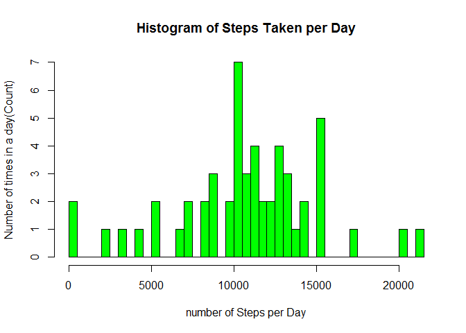
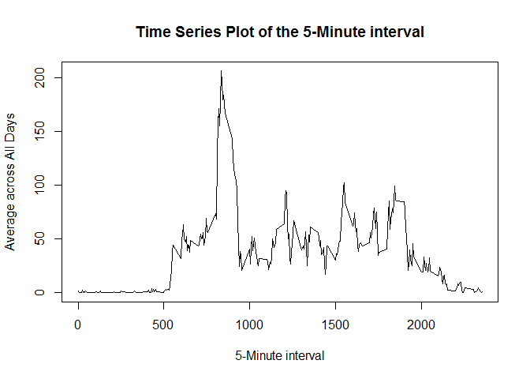
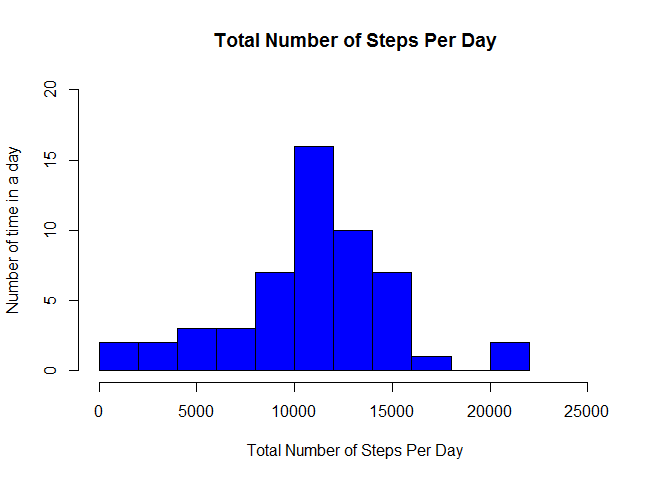
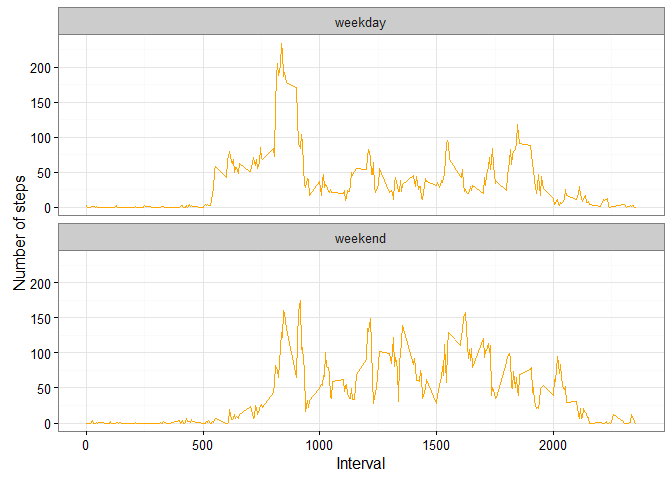

# RepData_PeerAssignment1


```r
library(knitr)
opts_chunk$set(fig.path = "figures/")
knitr::opts_chunk$set(echo = TRUE)


library(ggplot2)
library(plyr)
library(data.table)
```

## Assignment

This assignment will be described in multiple parts. You will need to write a report that answers the questions detailed below. Ultimately, you will need to complete the entire assignment in a single R markdown document that can be processed by knitr and be transformed into an HTML file.

##Data

The data for this assignment can be downloaded from the course web site:
Dataset: 
[Activity monitoring data](https://d396qusza40orc.cloudfront.net/repdata%2Fdata%2Factivity.zip)

The variables included in this dataset are:

steps: Number of steps taking in a 5-minute interval (missing values are coded as  NA )
date: The date on which the measurement was taken in YYYY-MM-DD format
interval: Identifier for the 5-minute interval in which measurement was taken


The dataset is stored in a comma-separated-value (CSV) file and there are a total of 17,568 observations in this dataset.


##Loading and preprocessing the data

Show any code that is needed to

1.Load the data (i.e.  read.csv() )


```r
getwd()
```

```
## [1] "C:/Users/root"
```

```r
activity<-read.csv(file="./repdata_data_activity/activity.csv", header = TRUE, sep =",", colClasses = c("numeric","character","numeric"))
```


2.Process/transform the data (if necessary) into a format suitable for your analysis


```r
activity$date<-as.Date(activity$date,format = "%Y-%m-%d")
activity$interval<-as.factor(activity$interval)
without_na<-activity[complete.cases(activity),]
with_na<-activity[!complete.cases(activity),]
total<-aggregate(steps~date,without_na,sum)
head(total)
```

```
##         date steps
## 1 2012-10-02   126
## 2 2012-10-03 11352
## 3 2012-10-04 12116
## 4 2012-10-05 13294
## 5 2012-10-06 15420
## 6 2012-10-07 11015
```

What is mean total number of steps taken per day?

For this part of the assignment, you can ignore the missing values in the dataset.

1.Make a histogram of the total number of steps taken each day


```r
hist(total$steps,col="green",breaks=40, main="Histogram of Steps Taken per Day", xlab="number of Steps per Day", ylab="Number of times in a day(Count)")
```

<!-- -->


2.Calculate and report the mean and median total number of steps taken per day


```r
steps_mean<-mean(total$steps)

print(steps_mean)
```

```
## [1] 10766.19
```

```r
steps_median<-median(total$steps)
print(steps_median)
```

```
## [1] 10765
```

## What is the average daily activity pattern?

1.Make a time series plot (i.e.  type = "l" ) of the 5-minute interval (x-axis) and the average number of steps taken, averaged across all days (y-axis)


```r
interval<-aggregate(steps~interval,without_na,mean)
names(interval)[2]<-"mean_steps"
interval$interval<-as.integer(levels(interval$interval)[interval$interval])


plot(x=interval$interval, y=interval$mean_steps,type="l",main = "Time Series Plot of the 5-Minute interval", xlab="5-Minute interval", ylab="Average across All Days")
```

<!-- -->


2.Which 5-minute interval, on average across all the days in the dataset, contains the maximum number of steps?


```r
max_interval<-interval[which.max(interval$mean_steps),]
print(max_interval)
```

```
##     interval mean_steps
## 104      835   206.1698
```

##Imputing missing values

Note that there are a number of days/intervals where there are missing values (coded as  NA ). The presence of missing days may introduce bias into some calculations or summaries of the data.

Calculate and report the total number of missing values in the dataset (i.e. the total number of rows with  NA s)


```r
missing_values<-sum(is.na(activity$steps))
print(missing_values)
```

```
## [1] 2304
```

A histogram of the total number of steps taken each day and Calculate and report the mean and median total number of steps taken per day.


```r
steps_per_day_nm<-as.data.frame(tapply(without_na$steps,INDEX=without_na$date,FUN="sum"))
colnames(steps_per_day_nm)<-"steps"
max_num_steps<-max(steps_per_day_nm)+5000
hist(steps_per_day_nm$steps,main="Total Number of Steps Per Day", xlab="Total Number of Steps Per Day", ylab = "Number of time in a day", breaks = 10,xlim = c(0,max_num_steps),ylim=c(0,20), col = "blue")
```

<!-- -->


4.Make  Do these values differ from the estimates from the first part of the assignment? What is the impact of imputing missing data on the estimates of the total daily number of steps?


```r
steps_mean_fill<-mean(steps_per_day_nm$steps, na.rm=TRUE)
print(steps_mean_fill)
```

```
## [1] 10766.19
```

```r
steps_median_fill<-median(steps_per_day_nm$steps, na.rm=TRUE)
print(steps_median_fill)
```

```
## [1] 10765
```

##Are there differences in activity patterns between weekdays and weekends?

For this part the  weekdays()  function may be of some help here. Use the dataset with the filled-in missing values for this part.

1.Create a new factor variable in the dataset with two levels -- "weekday" and "weekend" indicating whether a given date is a weekday or weekend day.


```r
weekdays_steps<-function(data){
  weekdays_steps<-aggregate(data$steps, by=list(interval=data$interval),
                            FUN=mean ,na.rm=TRUE)
  
  weekdays_steps$interval<-as.integer(levels(weekdays_steps$interval)[weekdays_steps$interval])
  colnames(weekdays_steps)<-c("interval","steps")
  weekdays_steps
}

by_weekdays<-function(data){
  data$weekday<-as.factor(weekdays(data$date))
  weekend<-subset(data,weekday%in% c("Saturday","Sunday"))
  weekday<-subset(data,!weekday%in% c("Saturday","Sunday"))
  
  weekend_steps<-weekdays_steps(weekend)
  weekday_steps<-weekdays_steps(weekday)
  
  weekend_steps$dayofweek<-rep("weekend",nrow(weekend_steps))
  weekday_steps$dayofweek<-rep("weekday",nrow(weekday_steps))
  
  by_weekdays<-rbind(weekend_steps,weekday_steps)
  by_weekdays$dayofweek<-as.factor(by_weekdays$dayofweek)
  by_weekdays
}
  

by_weekdays<-by_weekdays(without_na)

levels(by_weekdays$dayofweek)
```

```
## [1] "weekday" "weekend"
```

```r
table(by_weekdays$dayofweek)
```

```
## 
## weekday weekend 
##     288     288
```


2.Make a panel plot containing a time series plot (i.e.  type = "l" ) of the 5-minute interval (x-axis) and the average number of steps taken, averaged across all weekday days or weekend days (y-axis). The plot should look something like the following, which was created using simulated data:


```r
plot4<-ggplot(by_weekdays,aes(x=interval,y=steps))+geom_line(color="orange")+facet_wrap(~ dayofweek,nrow=2,ncol = 1) +labs(x="Interval",y="Number of steps")+theme_bw()
print(plot4)
```

<!-- -->
